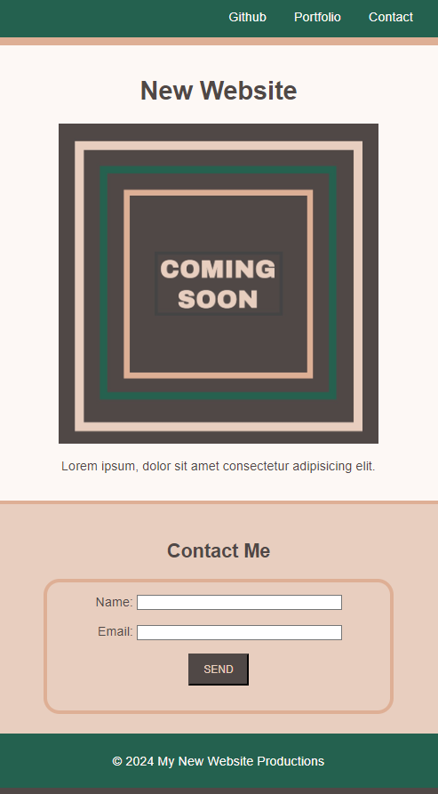

# Sample Landing Page

## Description

This sample landing page was built in order to develop a brief understanding of HTML, CSS, and Git by putting the learning into practice. I am now familiar with the different languages as well as Git Workflow. This webpage is a summary of my learning and understanding.

## Installation

No extra installations are required.

## Usage

Link to the website: https://illakaya.github.io/prework-study-guide/  
No special instructions are need to view the application. The form currently does not work and the web application is currently not responsive.

## Credits

Thank you to:

- The Coding Bootcamp at the University of Sydney for providing a project for students to develop their understanding of HTML semantic elements and basic CSS.

## License

Please refer to the LICENSE in the repo.
